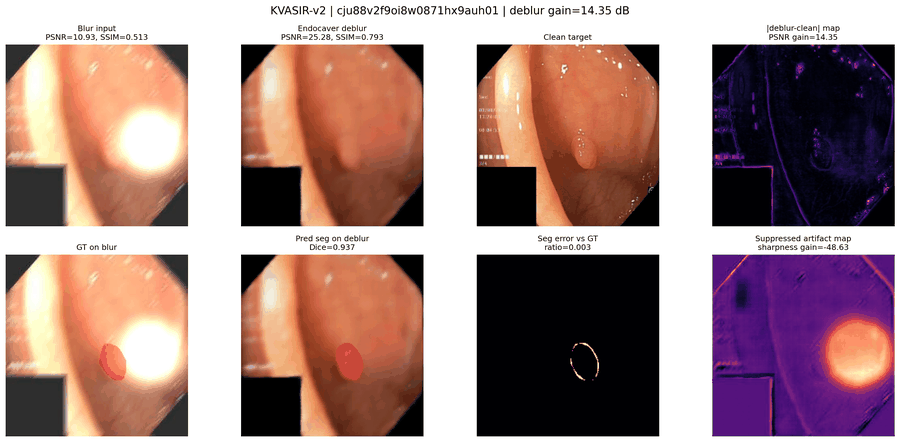
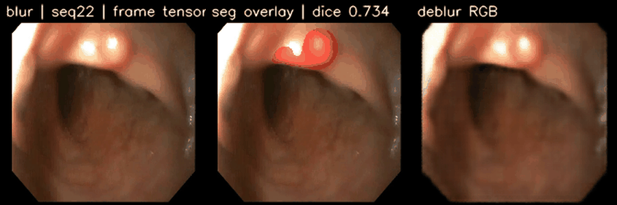
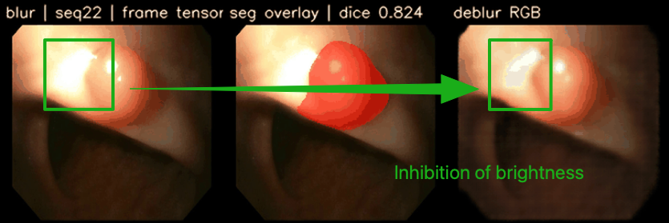
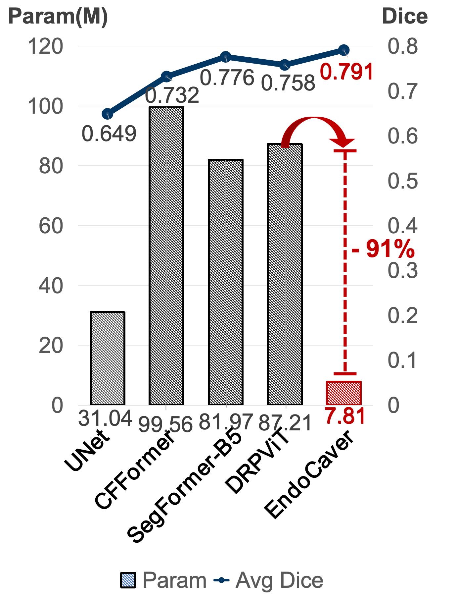
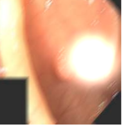

# EndoCaver: Handling Fog, Blur and Glare in Endoscopic Images via Joint Deblurring-Segmentation

[](https://ieeexplore.ieee.org/document/11461918)
[](https://arxiv.org/pdf/2601.22537)
[](LICENSE)

**Official PyTorch implementation of EndoCaver (ICASSP 2026)**

> **EndoCaver: Handling Fog, Blur and Glare in Endoscopic Images via Joint Deblurring-Segmentation**
> Zhuoyu Wu, Wenhui Ou, Pei-Sze Tan, Jiayan Yang, Wenqi Fang, Zheng Wang, Raphaël C.-W. Phan

Accepted at IEEE ICASSP 2026.

EndoCaver is a lightweight dual-decoder transformer for robust endoscopic image analysis under fog, motion blur, and specular glare. Given a degraded endoscopic image, the model jointly predicts:

1. a restored RGB image
2. a polyp segmentation mask

## Qualitative results

Kvasir Eval Set:



OOD / PolypGen sequence example:





## Highlights

- Joint deblurring and segmentation in one network
- Unidirectional deblurring-to-segmentation guidance
- Global Attention Module (GAM) for cross-scale aggregation
- Deblurring-Segmentation Aligner (DSA) for restoration-guided segmentation
- Compact model design for deployment-oriented endoscopic analysis

Paper-reported reference numbers:

- Parameters: 7.8M
- Complexity: 11.9 GMACs
- Kvasir-SEG clean Dice: 0.922
- Severe degradation Dice: 0.889

``

## Installation

```bash
git clone https://github.com/ReaganWu/EndoCaver.git
cd EndoCaver
pip install -r requirements.txt
```

## Checkpoint and ONNX artifacts

The release includes paper-aligned artifact names:

```text
checkpoints/EndoCaver_MiTB0_GAM_DSA_LoCoS_Kvasir.pt
checkpoints/EndoCaver_MiTB0_GAM_DSA_LoCoS_Kvasir.onnx
```

The name follows the arXiv description: EndoCaver with a MiT-B0 encoder, GAM, DSA, and LoCoS-style multi-task optimisation on Kvasir.

## Quick inference

Run the included Kvasir samples:

```bash
python scripts/infer.py \
  --local-files-only \
  --images samples/kvasir/images \
  --checkpoint checkpoints/EndoCaver_MiTB0_GAM_DSA_LoCoS_Kvasir.pt \
  --out samples/kvasir/outputs
```

The repository already includes two sample inputs and example outputs:

```text
samples/kvasir/images/
samples/kvasir/outputs/restored/
samples/kvasir/outputs/masks/
```

| Runtime            | Device / Provider            | Iterations |                                     Avg. Latency |   FPS |
| ------------------ | ---------------------------- | ---------: | -----------------------------------------------: | ----: |
| PyTorch checkpoint | NVIDIA A100 40GB             |          5 |                                         36.22 ms | 27.61 |
| ONNX Runtime CPU   | CPUExecutionProvider         |          3 |                                        162.90 ms |  6.14 |
| ONNX Runtime GPU   | CUDAExecutionProvider (A100) |          5 | 11.41 ms (-68% latency compared with Torch.eval) | 87.65 |

Example sample image:



## Minimal training example

This repository includes a compact Kvasir-only training example. It is intended as a simple reference for data format and model usage.

Expected Kvasir layout:

```text
Kvasir-SEG/
  images/
    xxx.jpg
  masks/
    xxx.jpg
```

Run:

```bash
python train.py \
  --data /path/to/Kvasir-SEG \
  --epochs 3000 \
  --batch-size 16 \
  --out checkpoints/EndoCaver_MiTB0_GAM_DSA_LoCoS_Kvasir.pt
```

For details, see `docs/TRAINING.md`.

## Model usage

```python
import torch
from endocaver import EndoCaver

model = EndoCaver().eval()
x = torch.randn(1, 3, 224, 224)

with torch.no_grad():
    restored_rgb, seg_prob = model(x)

print(restored_rgb.shape)  # [1, 3, 224, 224]
print(seg_prob.shape)      # [1, 1, 224, 224]
```

## Repository structure

```text
EndoCaver/
  endocaver/
    model.py          # GAM, DSA, dual decoders, EndoCaver model
    data.py           # small Kvasir-style dataset helper
  scripts/
    infer.py          # folder inference example
  checkpoints/        # paper-aligned PT and ONNX artifacts
  samples/kvasir/     # two sample Kvasir images and example outputs
  assets/             # README GIFs and qualitative examples
  docs/
    TRAINING.md       # compact Kvasir training note
    RUNTIME.md        # PT/ONNX runtime check commands and numbers
    CITATION.md       # citation information
  train.py            # single-file Kvasir training example
```

## Citation

```bibtex
@inproceedings{wu2026endocaver,
  title={EndoCaver: Handling Fog, Blur and Glare in Endoscopic Images via Joint Deblurring-Segmentation},
  author={Wu, Zhuoyu and Ou, Wenhui and Tan, Pei-Sze and Yang, Jiayan and Fang, Wenqi and Wang, Zheng and Phan, Rapha{\"e}l C.-W.},
  booktitle={IEEE International Conference on Acoustics, Speech and Signal Processing (ICASSP)},
  year={2026}
}

@article{wu2026endocaver,
  title={EndoCaver: Handling Fog, Blur and Glare in Endoscopic Images via Joint Deblurring-Segmentation},
  author={Wu, Zhuoyu and Ou, Wenhui and Tan, Pei-Sze and Yang, Jiayan and Fang, Wenqi and Wang, Zheng and Phan, Rapha{\"e}l C-W},
  journal={arXiv preprint arXiv:2601.22537},
  year={2026}
}
```

## Acknowledgements

This implementation uses PyTorch, timm, Hugging Face Transformers, Albumentations, and einops.

## License

See `LICENSE`.
